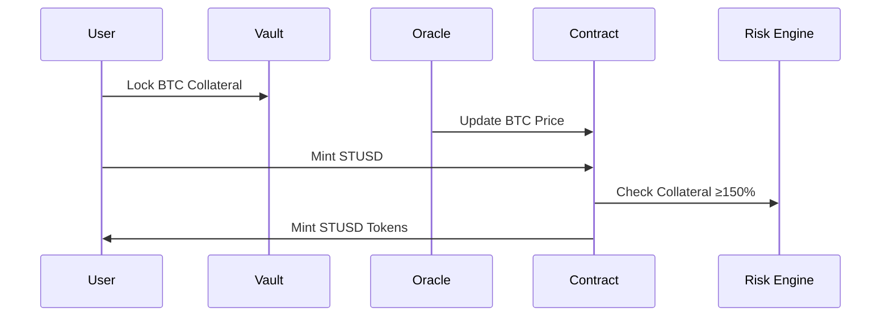
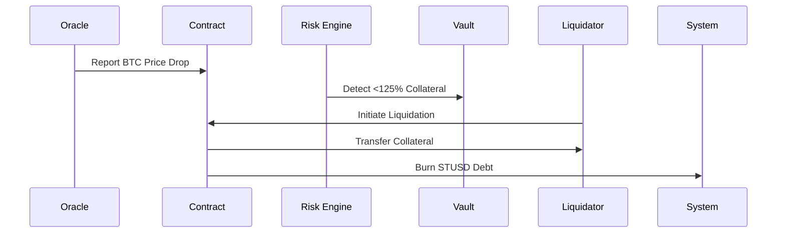

# 🟠 Satoshi Standard (STUSD): Bitcoin-Backed Stablecoin Protocol

**Satoshi Standard (STUSD)** is a decentralized, overcollateralized stablecoin protocol built on the **Stacks Layer 2**, leveraging **native Bitcoin** as collateral to mint a **USD-pegged stablecoin**. It ensures trustless stability, Bitcoin finality, and secure vault-based asset management through programmable smart contracts.

## 📌 Overview

* **Stablecoin:** STUSD (USD-pegged)
* **Collateral:** Bitcoin (via Stacks)
* **Layer 1:** Bitcoin (settlement)
* **Layer 2:** Stacks Blockchain (Clarity smart contracts)
* **Token Standard:** SIP-010
* **Oracles:** Decentralized BTC/USD price feeds
* **Stability Mechanism:** 150% overcollateralization, 125% liquidation threshold
* **Governance:** Protocol-controlled adjustable parameters

## 🧱 Protocol Architecture

### 🏦 1. Vault Management

Users deposit BTC to open **vaults** and mint STUSD proportionally.

**Key Operations:**

* `create-vault(collateral-amount)`
* `mint-stablecoin(vault-id, amount)`
* `redeem-stablecoin(vault-id, amount)`
* `liquidate-vault(vault-id)`

**Vault State:**

* `collateral-amount`
* `stablecoin-minted`
* `created-at`

### 📈 2. Oracle System

Decentralized oracle network provides real-time BTC/USD prices.

**Functions:**

* `add-btc-price-oracle(oracle)`
* `update-btc-price(price, timestamp)`
* `get-latest-btc-price()`

**Security:**

* Multi-provider aggregation
* Timestamp validation
* Sanity bounds (`MAX-BTC-PRICE`)

### 🛡️ 3. Risk Management

Ensures system solvency through:

* **Min Collateral Ratio:** 150%
* **Liquidation Threshold:** 125%
* **Liquidation Process:** Third-party initiated
* **Liquidation Incentive:** 25% buffer for safety

### 🗳️ 4. Governance

Protocol owner can update key parameters. Future upgrades may introduce DAO governance.

**Functions:**

```clarity
(update-collateralization-ratio new-ratio)
(update-mint-fee new-fee-bps)
(add-btc-price-oracle oracle-principal)
```

## 🔐 Security Model

* **Overcollateralization**
* **Oracle manipulation resistance**
* **Timestamp and price checks**
* **Front-running and reentrancy protections**
* **Access control on sensitive operations**

## 🔧 Contract Interfaces

### ✅ Core Functions

| Function            | Parameters           | Description                                 |
| ------------------- | -------------------- | ------------------------------------------- |
| `create-vault`      | `collateral-amount`  | Initialize a new BTC vault                  |
| `mint-stablecoin`   | `vault-id`, `amount` | Mint STUSD if vault is sufficiently backed  |
| `redeem-stablecoin` | `vault-id`, `amount` | Burn STUSD and release collateral           |
| `liquidate-vault`   | `vault-id`           | Liquidate vault below 125% collateral ratio |

### 🔍 Read-Only

* `get-vault-details(vault-owner, vault-id)`
* `get-total-supply()`
* `get-latest-btc-price()`

## 💵 STUSD Token Interface (SIP-010)

Implements standard SIP-010 functions:

* `transfer`
* `get-name`
* `get-symbol`
* `get-decimals`
* `get-balance`
* `get-total-supply`

## 🔁 Key Workflows

### Minting STUSD



### Liquidation Process



## 🧪 Error Codes

| Code    | Description               |
| ------- | ------------------------- |
| `u1000` | Not Authorized            |
| `u1001` | Insufficient Balance      |
| `u1002` | Invalid Collateral        |
| `u1003` | Undercollateralized Vault |
| `u1004` | Oracle Price Unavailable  |
| `u1005` | Liquidation Failed        |
| `u1006` | Mint Limit Exceeded       |
| `u1007` | Invalid Parameters        |
| `u1008` | Unauthorized Vault Action |

## 🚀 Installation & Usage

### Prerequisites

* Stacks Node v3.0+
* Clarinet SDK
* Bitcoin Testnet Access

### Setup

```bash
git clone https://github.com/satoshistandard/protocol.git
cd protocol
clarinet install
cp .env.example .env
clarinet test
```

### Sample Transaction

```clarity
;; Lock 1 BTC in vault
(contract-call? .satoshistandard create-vault u100000000)

;; Mint 5000 STUSD from vault #1
(contract-call? .satoshistandard mint-stablecoin tx-sender u1 u5000000000)
```

---

## 🧭 Future Enhancements

* Support for sBTC or DLC-based BTC vaulting
* DAO-based governance
* Vault dashboard UI
* Multi-collateral support
